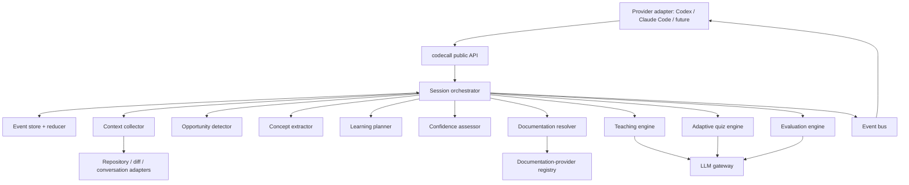
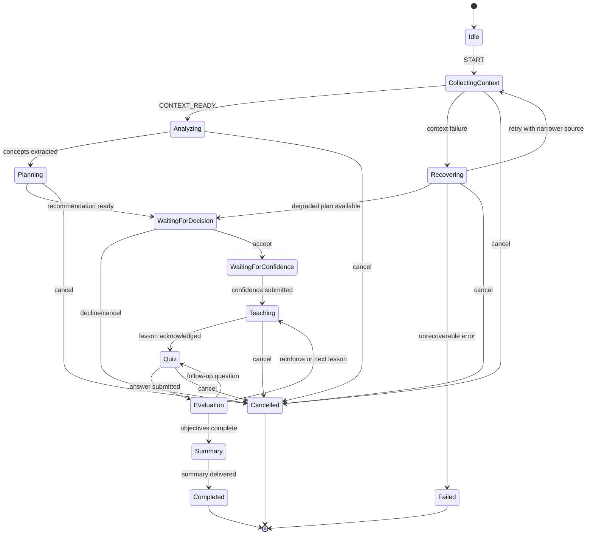
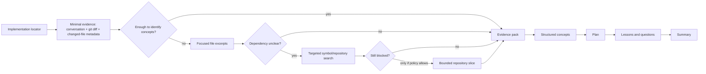

# `codecall` MVP architecture proposal

## 1. Purpose and product boundary

`codecall` is an agent-native capability invoked after an implementation. It turns
evidence from that implementation into a short, adaptive learning session. It
does **not** generate generic documentation, replay a commit, or interrupt a
developer without consent.

The MVP has one public entry point:

```text
codecall()
```

Provider adapters may expose it as `/codecall`, a tool call, or an agent-suggested
card, but the domain runtime is provider-neutral. A recommendation is an
optional `LearningOpportunity`; it never starts a session itself.

### MVP outcomes

- decide whether there is a worthwhile learning opportunity;
- teach implementation-specific concepts in dependency order;
- adapt depth from a developer's declared confidence and answers;
- assess reasoning using MCQ questions grounded in the implementation;
- return a concise, reproducible summary.

### Explicit non-goals

- persistence across sessions, spaced repetition, analytics, a standalone UI,
  repository-wide indexing, or automatic interruption;
- claiming a user has mastered a topic from one short quiz;
- collecting or exporting source code telemetry by default.

## 2. Design decisions and principles

| Decision | Recommendation | Why |
| --- | --- | --- |
| Runtime | Reducer-driven, resumable orchestration engine | Event history makes every session inspectable and replayable. |
| Context | Progressive, budgeted evidence acquisition | Keeps sessions fast and avoids unnecessary repository exposure. |
| Reasoning | LLM workers over typed inputs/outputs | Extraction and pedagogy are judgment tasks, but contracts prevent prompt-only coupling. |
| Determinism | Deterministic policy, validation, state transitions, budgets, and event emission | Reproducible control flow without pretending teaching content is deterministic. |
| Persistence | Caller-owned event log/checkpoint for MVP | No hidden state; providers choose local file, memory, or encrypted store. |
| Documentation | Ranked provider registry, retrieval only when it adds value | Official sources strengthen claims while preserving offline/model-knowledge fallback. |
| UX | Streaming events plus explicit user gates | A provider can render progress, cancellation, and answers without exposing workers. |

The runtime must never silently widen context. Each context request records its
purpose, scope, budget, result, and whether it was denied or unavailable.

## 3. Component diagram



`O` owns sequencing only. Workers cannot call each other, mutate session state,
nor emit provider-specific content; they receive a typed request and return a
typed result plus evidence references.

## 4. Public API

```ts
export interface LearnCapability {
  start(input: StartSessionInput, deps: RuntimeDependencies): AsyncIterable<LearnEvent>;
  answer(input: SubmitAnswerInput, deps: RuntimeDependencies): AsyncIterable<LearnEvent>;
  cancel(input: CancelSessionInput, deps: RuntimeDependencies): AsyncIterable<LearnEvent>;
  resume(input: ResumeSessionInput, deps: RuntimeDependencies): AsyncIterable<LearnEvent>;
}

export interface StartSessionInput {
  invocation: 'manual' | 'recommended';
  implementation: ImplementationLocator;
  user?: { id?: string; locale?: string };
  options?: { maxMinutes?: number; offline?: boolean; privacyMode?: 'local-only' | 'allow-doc-fetch' };
}
```

`start` emits an opportunity before requesting confidence. If recommendation is
declined, it emits `SESSION_CANCELLED` with reason `user_declined`; no teaching
or documentation retrieval occurs. `answer` and `resume` take the latest event
sequence/checkpoint, never an opaque server-side session identifier alone.

## 5. Runtime sequence

```mermaid
sequenceDiagram
  participant U as Developer
  participant A as Provider adapter
  participant O as Orchestrator
  participant W as Workers
  participant DS as Documentation provider
  U->>A: /codecall or Start Learning
  A->>O: start(implementation locator)
  O-->>A: SESSION_STARTED
  O->>W: collect minimal context
  W-->>O: context + evidence
  O->>W: detect opportunity; extract concepts; make plan
  W-->>O: opportunity + plan
  O-->>A: LEARNING_RECOMMENDATION
  U->>A: start / skip
  alt skipped
    A->>O: cancel(user_declined)
    O-->>A: SESSION_CANCELLED
  else started
    A->>O: confidence answers
  O->>W: resolve docs and teach the smallest next learning step
    W->>DS: optional authoritative lookup
    DS-->>W: cited sources or unavailable
    O-->>A: LESSON_READY
    loop adaptive teach-check loop
      U->>A: answer a single check-in question
      A->>O: submitAnswer
      O->>W: evaluate understanding and select the next teaching move
      O-->>A: feedback, a deeper explanation, a worked example, or one next question
    end
    O-->>A: SESSION_FINISHED + summary
  end
```

## 6. Formal state machine



Recovery is not a vague catch-all. It has classified causes: unavailable source,
budget exhausted, invalid worker result, documentation failure, LLM failure, or
provider disconnect. The reducer retries only idempotent operations. A restart
uses the event history and `operationId` to avoid duplicate lessons or answers.

## 7. Data flow and progressive context



The default acquisition ladder is:

1. conversation task/result, changed-file paths, and diff summary;
2. bounded excerpts from changed files around relevant symbols;
3. targeted symbol definitions, direct imports/callers, and narrow search hits;
4. a declared bounded repository slice only when an unresolved dependency blocks
   a learning claim.

There is no default “entire repository” step. The collector enforces file,
byte, token, duration, and sensitive-path budgets. Each excerpt carries a
stable `EvidenceRef` (path, revision, line span, hash) so later teaching can
cite what it actually used.

## 8. Workers and responsibilities

| Worker | Sole responsibility | Must not do |
| --- | --- | --- |
| Context collector | Acquire the smallest evidence pack that satisfies a declared question | Judge learning value or teach |
| Opportunity detector | Score whether a session is worthwhile and estimate duration | Extract detailed pedagogical concepts |
| Concept extractor | Produce the concept IR, evidence links, and misconceptions | Decide final teaching sequence |
| Learning planner | Build a deduplicated dependency-aware plan | Fetch docs or write prose |
| Confidence assessor | Collect and normalize user confidence per plan unit | Infer confidence from coding speed |
| Documentation resolver | Find/rank authoritative sources for requested concepts | Author lessons |
| Teaching engine | Produce one implementation-grounded lesson | Change session policy or quiz outcomes |
| Adaptive quiz engine | Generate the next reasoning-focused MCQ | Declare mastery |
| Evaluation engine | Grade response, diagnose misconception, choose reinforcement signal | Render UI or persist state |
| Summary builder | Derive the final summary from plan, evidence, and evaluations | Invent unobserved learning |

The orchestrator coordinates workers and validates contracts. A policy module
owns thresholds, budget rules, and the allowed state transitions; it is not a
worker because its behavior must be deterministic and versioned.

## 9. Internal contracts

All contracts are versioned, JSON-serializable, validated at every worker
boundary, and stored with the prompt/template and model metadata needed for
replay. Illustrative TypeScript shapes:

```ts
type SessionState =
  | 'idle' | 'collecting_context' | 'analyzing' | 'planning'
  | 'waiting_for_decision' | 'waiting_for_confidence' | 'teaching'
  | 'quiz' | 'evaluation' | 'summary' | 'completed' | 'cancelled'
  | 'recovering' | 'failed';

interface Session {
  schemaVersion: 1;
  id: string; state: SessionState; createdAt: string;
  implementation: ImplementationLocator; policyVersion: string;
  eventSequence: number; evidence: EvidencePack; plan?: LearningPlan;
  currentUnitId?: string; failures: RecoveryRecord[];
}

interface ImplementationContext {
  revision?: string; task?: string; diff?: DiffSummary;
  changedFiles: ChangedFile[]; excerpts: EvidenceRef[];
  unresolvedQuestions: ContextQuestion[]; budget: ContextBudget;
}

interface LearningOpportunity {
  score: number; confidence: number; estimatedMinutes: number;
  recommendation: 'recommend' | 'optional' | 'skip';
  signals: OpportunitySignal[]; reasoning: string[];
}

interface Concept {
  id: string; label: string;
  category: 'technology' | 'concept' | 'pattern' | 'anti_pattern' | 'architecture_decision' | 'misconception';
  description: string; evidence: EvidenceRef[]; prerequisites: string[];
  difficulty: 1 | 2 | 3 | 4 | 5; novelty: number; implementationRelevance: number;
}

interface LearningPlan {
  units: LearningUnit[]; dependencyEdges: DependencyEdge[];
  estimatedMinutes: number; objectives: LearningObjective[];
  omittedConcepts: Omission[];
}

interface DocumentationResult {
  conceptId: string; status: 'resolved' | 'unavailable' | 'not_needed';
  sources: DocumentationSource[]; retrievalNotes: string[];
}

interface Lesson {
  unitId: string; objective: string; what: string; whyHere: string;
  failureMode: string; connections: string[]; misconceptions: string[];
  mentalModel: string; minimalExample: CodeExample; evidence: EvidenceRef[];
  citations: DocumentationSource[];
}

interface Question {
  id: string; unitId: string; prompt: string; choices: Choice[];
  correctChoiceId: string; rationales: Record<string, string>;
  evidence: EvidenceRef[]; intent: 'causal_reasoning' | 'tradeoff' | 'debugging' | 'system_design';
}

interface Evaluation {
  questionId: string; correct: boolean; confidenceDelta: number;
  diagnosedMisconceptions: string[]; action: 'advance' | 'reinforce' | 'retry'; rationale: string;
}

interface Summary {
  conceptsLearned: LearnedConcept[]; weakAreas: WeakArea[];
  estimatedMastery: MasteryEstimate; takeaways: string[];
  pointsToRemember: string[]; edgeCasesForOtherProjects: string[];
  limitations: string[];
}
```

`Concept.category` is deliberately singular. A relationship, such as a pattern
implemented with a technology, lives in typed links; this prevents categories
from collapsing into one ambiguous list.

## 10. Opportunity scoring and planning policy

The agent-backed product uses the shared skill policy as the authority; the
deterministic runtime mirrors it for local demonstrations and parity tests. It
does not infer learning value from LOC or file count.

An implementation is eligible only after completion and with inspectable task,
conversation, or changed-file evidence. It receives `recommend` when it has one
strong signal or two distinct moderate signals. Strong signals are an external
contract/integration, architecture or cross-component flow, a security or
reliability boundary, or a consequential tradeoff. Moderate signals are a
reusable pattern/lifecycle, a connected dependency relationship, or an
operational configuration, observability, validation, test-strategy, or
deployment change. One moderate signal is `optional`; no qualifying evidence is
`skip`.

Formatting, copy, comments, mechanical renames, generated-only files, isolated
dependency bumps, straightforward local fixes, and tests without a transferable
strategy do not produce automatic cards. Every result records matched strong and
moderate signals, excluded categories, an evidence-backed reason, and a stable
concept fingerprint. A runtime-local set suppresses repeated evaluation of the
same fingerprint; no learner history is persisted across sessions or projects.

Only `recommend` renders a non-blocking Start/Skip card. `optional` and `skip`
leave manual `/codecall` or `$codecall` available. No outcome starts teaching without
developer consent.

The planner removes duplicate concepts by canonical identity plus scope, merges
closely related nodes into a unit only when their prerequisites and objective
match, and topologically orders dependencies. It produces a **learning graph**,
not a fixed lesson/quiz script: each unit has mastery signals, prerequisite
edges, and alternative next moves. The runtime normally starts with the
highest-value prerequisite-ready unit and stops when the developer has met the
session objective or budget. It prioritizes architecture decisions and causal
links over vocabulary. Estimated time is derived from likely teaching moves,
confidence adjustment, and check-ins—not implementation size.

## 11. Teaching and quiz policy

For every unit, the teaching engine must answer: what it is; why this code
needed it; what fails without it; how it connects to adjacent units; common
misconceptions; a mental model; and a minimal example. Claims about the
implementation cite `EvidenceRef`s. If evidence is weak, the lesson states the
assumption rather than presenting it as fact.

The confidence gate asks one selectable level per unit or grouped prerequisite:
`expert`, `comfortable`, `heard_of_it`, `never_learned`. Users may skip, which
selects a neutral baseline. Confidence controls pace and question difficulty;
it never hides foundational prerequisite units that are necessary to understand
the implementation.

Questions are MCQ-only for MVP and must be implementation-aware. They are
**single check-ins**, introduced immediately after enough teaching to make a
reasoning judgment meaningful—not queued and thrown at the developer together.
For each concept unit, use two complementary checks: a real-world scenario
mapped explicitly back to the implementation mechanism, followed by a technical
application, dependency, tradeoff, or debugging question. Distractors represent
plausible misconceptions, and each choice has an explanation. The evaluator
uses the answer, confidence, and observed evidence to select the next learning
move: `advance`, `deepen`, `reinforce`, `retry`, or `finish`. A correct first
answer advances to the technical check for the same concept; uncertainty may
lead to a simpler mental model; an incorrect response first teaches the
diagnosed gap and only then asks a new isomorphic question. The system stops
asking questions once it has enough evidence for the session objective; it does
not chase a preset question count.

## 12. Event model, observability, and replay

Events are append-only records with `sessionId`, `sequence`, timestamp,
`operationId`, actor, contract version, sanitized payload, and correlation ID.
The reducer is the only component that transitions state.

Core events:

```text
SESSION_STARTED, CONTEXT_REQUESTED, CONTEXT_READY, CONTEXT_DEGRADED,
OPPORTUNITY_DETECTED, CONCEPTS_EXTRACTED, PLAN_CREATED,
LEARNING_RECOMMENDATION_PRESENTED, DECISION_RECORDED,
CONFIDENCE_RECORDED, DOCUMENTATION_RESOLVED, LESSON_STARTED, LESSON_READY,
QUESTION_PRESENTED, QUESTION_ANSWERED, ANSWER_EVALUATED, REINFORCEMENT_READY,
QUIZ_COMPLETED, SUMMARY_READY, SESSION_FINISHED, SESSION_CANCELLED,
OPERATION_FAILED, RECOVERY_STARTED, RECOVERY_SUCCEEDED, SESSION_FAILED
```

The public stream is a projection of these events. Raw prompts, source excerpts,
and answer text remain local by default; observability exposes timing, contract
validation failures, budget use, and redacted diagnostic codes. Event-log
replay must reproduce decisions for the same policy/template/model outputs;
LLM output is recorded or content-addressed so replay does not require a new
model call.

## 13. Documentation system

`DocumentationProvider` has `canResolve(concept)`, `search(query, budget)`,
and `fetch(sourceId)` contracts. The resolver ranks results by authority,
concept match, version match, stability, and accessibility. Default provider
order: language/framework/package official docs, standards/RFCs, project-local
docs, then model knowledge marked `uncited`.

Documentation fetch is optional and user-policy controlled. It has a strict
domain allowlist per provider, timeout/byte limits, content sanitization, and
source/version metadata. Offline mode disables network providers and visibly
labels model-only explanations. Documentation is evidence for a teaching claim,
not a replacement for implementation evidence.

## 14. Repository structure

```text
codecall/
├── README.md
├── ARCHITECTURE.md
├── package.json
├── src/
│   ├── public/                 # codecall(), provider-neutral facade
│   ├── runtime/                # orchestrator, reducer, state machine, recovery
│   ├── workers/                # one directory/module per worker
│   ├── schemas/                # versioned runtime contracts and validators
│   ├── adapters/                # provider, git, repository, LLM, storage adapters
│   ├── registries/             # documentation and provider registration
│   ├── prompts/                # versioned worker prompt templates
│   ├── policy/                 # scoring, budgets, planning and privacy policy
│   └── shared/                 # ids, errors, event helpers, redaction
├── test/
│   ├── unit/
│   ├── contract/
│   ├── integration/
│   ├── fixtures/               # small known implementations and event logs
│   └── e2e/
├── docs/                       # adapter authoring and architecture decision records
└── examples/                   # mock provider integration, never product code
```

Adapters depend inward on contracts; runtime and workers never import a provider
SDK. Prompt templates are data/versioned assets, so an evaluation can identify
which template generated a lesson.

## 15. Technology stack justification

Use TypeScript on Node.js for the core. It offers a broad agent integration
surface, native async streaming, excellent schema/test tooling, and distributable
single-package ergonomics. Use Zod (or an equivalent runtime validator) because
LLM and adapter boundaries need runtime—not only compile-time—validation. Use
a small event emitter plus an append-only storage interface rather than a
workflow framework for MVP; the state graph is compact and explicit.

Use Vitest for fast unit/contract tests and deterministic fake adapters. Use
JSON Lines as the default local event-log format: human-readable, appendable,
portable, and enough for MVP. Keep the LLM gateway interface provider-agnostic;
it accepts structured request/response schemas and supports injected test
fixtures. No database, vector store, queue, or web UI is justified in MVP.

## 16. Tradeoffs and risks

| Area | Recommended tradeoff | Risk and mitigation |
| --- | --- | --- |
| Recommendation timing | Show only after analysis, never auto-start | Extra latency; set a small analysis budget and permit a low-detail recommendation. |
| Confidence input | Ask explicitly before teaching | Friction; group units and offer skip/default. |
| Streaming | Stream typed milestones, not partial hidden reasoning | Provider rendering varies; retain a blocking collector for simple adapters. |
| Context | Progressive targeted reads | May miss a global convention; disclose evidence limits and request a bounded expansion. |
| LLM evaluation | LLM grades reasoning with structured rubric | Inconsistency; use deterministic schema checks, fixture evaluations, and conservative mastery language. |
| Docs | Optional official retrieval | Stale/unavailable network; version-pin sources when possible and graceful offline fallback. |
| Resume | Event-log replay/checkpoint | Event content can be sensitive; use caller-controlled local storage, encryption hooks, and redaction. |
| Provider support | Thin adapters | UX parity is not immediate; define a capability matrix and degrade to text prompts. |
| Telemetry | Local diagnostics, opt-in aggregate metrics | Privacy; default no source/answer export and publish the event schema. |

Security posture: treat repository content and retrieved documentation as
untrusted input; do not execute excerpts, follow embedded instructions, or
allow content to alter policy. Redact known secrets before an LLM boundary,
limit paths/providers, and preserve least-privilege adapter access.

## 17. Implementation roadmap (after approval)

1. Establish package, contracts, reducer/state machine, event log, fake adapters,
   and contract tests.
2. Build minimal context collector using conversation/diff/changed-file metadata
   and deterministic budget enforcement.
3. Add opportunity detection, concept extraction, and dependency planner with
   fixture-driven evaluations.
4. Add confidence gate, teaching/quiz/evaluation loop, and summary builder.
5. Add documentation-provider registry plus offline fallback and citations.
6. Implement Codex and Claude Code adapters against the same public capability;
   verify cancellation, resume, and degraded-mode behavior.
7. Run quality/security/accessibility review, publish contributor and adapter
   documentation, and release an explicitly scoped MVP.

Each phase has a working vertical slice; do not build future memory, graph, or
analytics infrastructure in anticipation of later work.

## 18. Testing strategy

- Unit tests: reducers, legal transitions, scoring bounds, planner ordering,
  budgets, redaction, and deterministic fallback policy.
- Contract tests: every worker input/output, provider adapter, documentation
  provider, and event version validates at runtime.
- Fixture integration tests: small implementations such as OAuth middleware,
  cache invalidation, async retries, and migrations; assert evidence grounding,
  dependency order, and question relevance.
- Replay tests: event logs reproduce exactly one terminal result without
  duplicate operations.
- LLM quality evaluations: rubric-score grounding, misconception quality,
  distractor plausibility, calibration, and unsupported-claim rate. Version
  prompt/model/policy inputs and use a held-out fixture set.
- Adversarial tests: malicious repository text, secrets, unavailable docs,
  malformed LLM JSON, stale revisions, cancel during every state, and reconnect
  after every event.
- Accessibility/UX tests: keyboard-only confidence and MCQ flow, concise
  announcements for streaming milestones, and text-only provider fallback.

## 19. Extension points, deliberately deferred

Future long-term memory consumes completed `Summary` events through a separate
`LearnerProfileStore`; it must not alter the MVP session schema. Knowledge graphs
can consume `Concept` and `DependencyEdge` records. Spaced repetition can
subscribe to `Evaluation` and `Summary` events. Interview mode replaces the
quiz worker behind the same `AssessmentStrategy` interface. New agent support
implements `ProviderAdapter`; new documentation sources implement
`DocumentationProvider`.

No extension is pre-built beyond interfaces and event contracts. This preserves
the MVP's small surface while avoiding a refactor of its core data flow.

## 20. Approval gates

Implementation must wait for decisions on the following unresolved product
choices. The recommended defaults are intentionally visible rather than hidden:

1. **Recommendation UX:** should agents show an automatic post-task recommendation
   when score thresholds are met, or only surface `/codecall` on manual invocation?
   Recommendation: automatic, non-blocking card with Start/Skip.
2. **Confidence UX:** should confidence be asked once per session or per learning
   unit? Recommendation: grouped per unit, with a “use a default” skip action.
3. **Repository consent:** may the collector read targeted unchanged files without
   a second prompt, or must every expansion be explicitly approved? Recommendation:
   permit bounded targeted reads and disclose them in the session; require consent
   only for a larger repository slice.
4. **Documentation network policy:** is network retrieval enabled by default when
   authoritative sources exist? Recommendation: enabled only by an explicit
   privacy setting or provider-level consent; offline/model-only by default.
5. **Session storage:** should resumable event logs live locally by default, or
   should MVP be memory-only? Recommendation: caller-owned local JSONL with a
   memory-only option.
6. **Initial provider scope:** do you want Codex and Claude Code released together,
   or should one adapter establish the reference UX first? Recommendation: core
   plus one reference adapter first, then the second against contract tests.
7. **Mastery wording:** may the UI say “mastered,” or should it report a bounded
   session estimate? Recommendation: “estimated session mastery” only.
